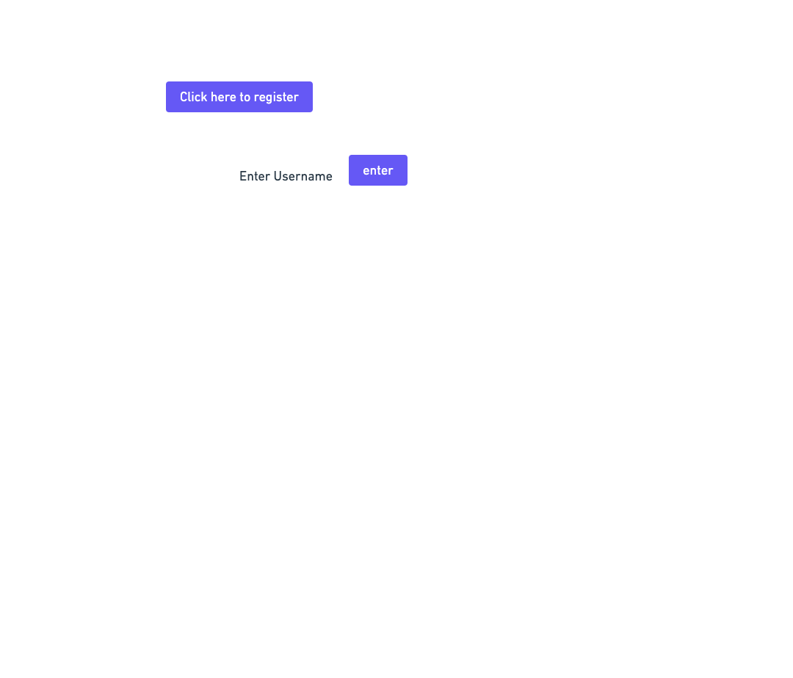
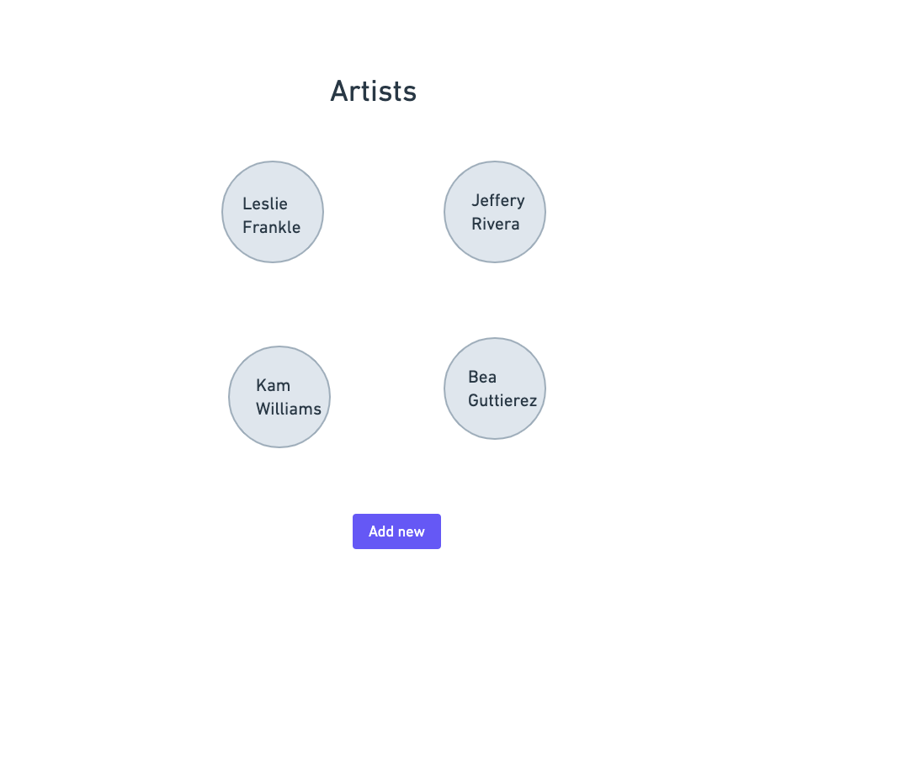
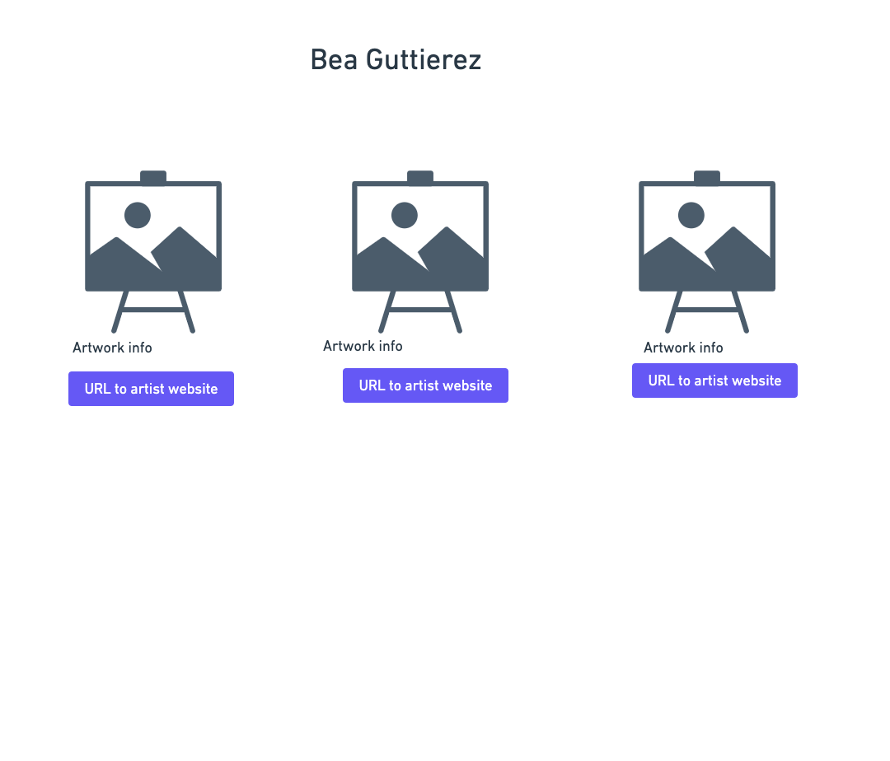
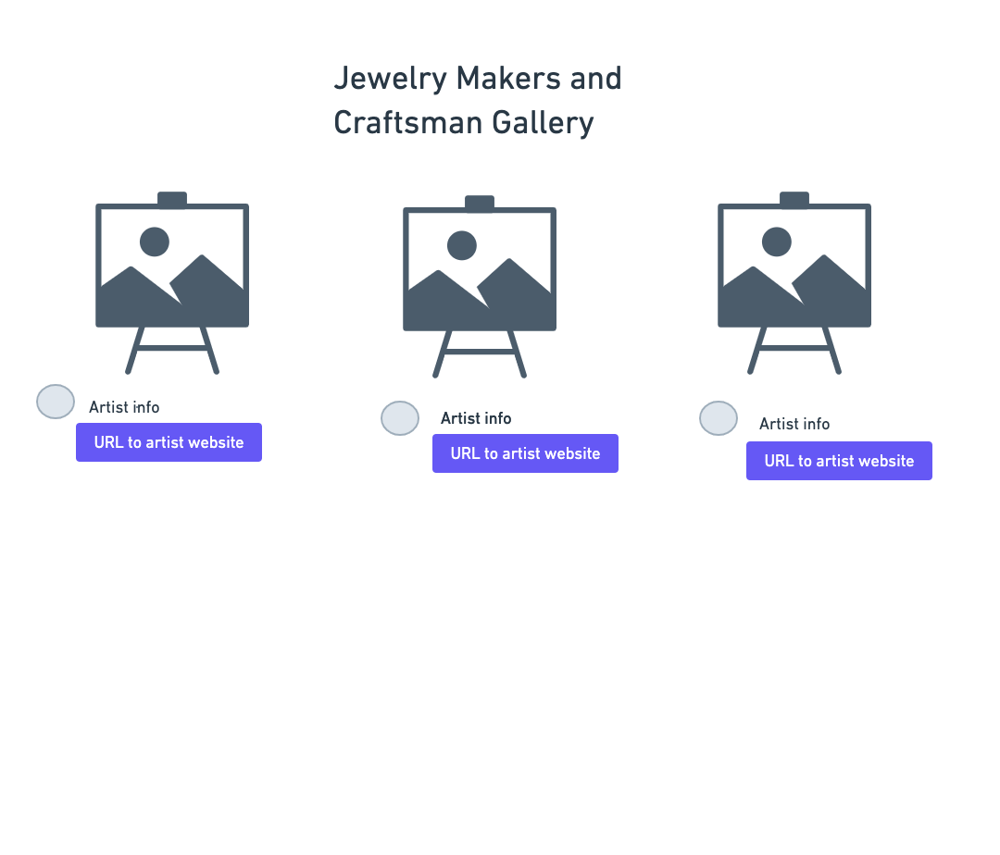
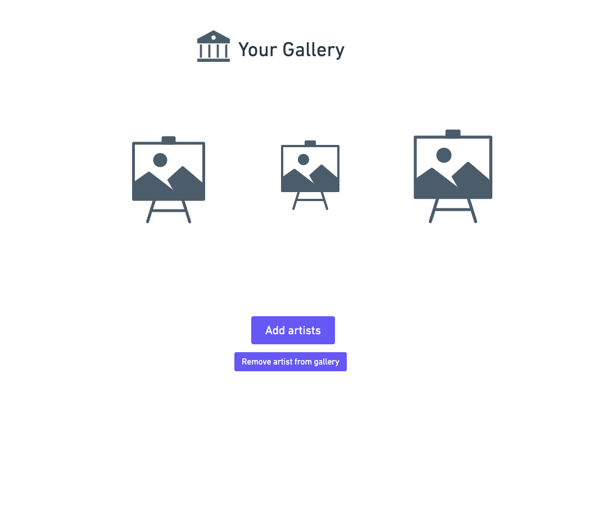
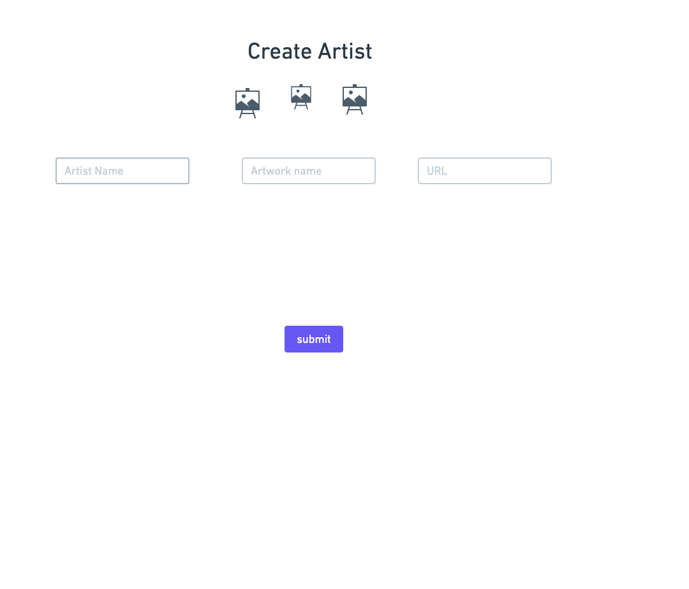

# User Story

User enters site as curator and can edit their own profile, search artists(friends) and select artists to add to their profile. With hope to eventually have a user enter as either a viewer, curator, or artist. The curator can select artists to feature in their
gallery. The can edit their gallery as they wish.

We will be utilizing Mongodb, Mongoose, Express, EJS CSS, Javascript, HTML

Sprints:

Friday- MVC- reorginize folder structure and routes
Friday-Planning for weekend, designate tasks/focus

Weekend- Build schemes for Artists and Curators aka Models, Full functionality for Controllers, at least Partial views
Monday- Finish EJS CSS planning and designating, icebox decisions
Tuesday- Ejs and CSS

